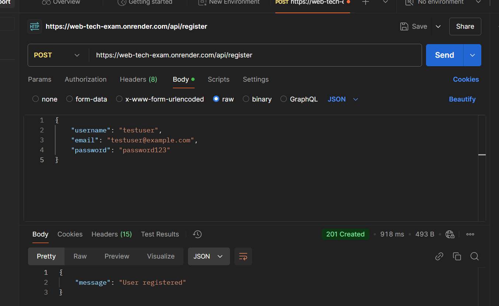
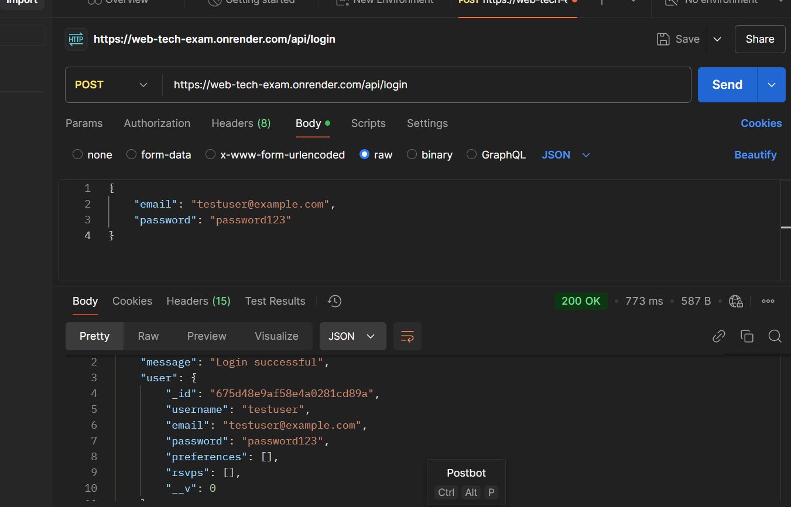
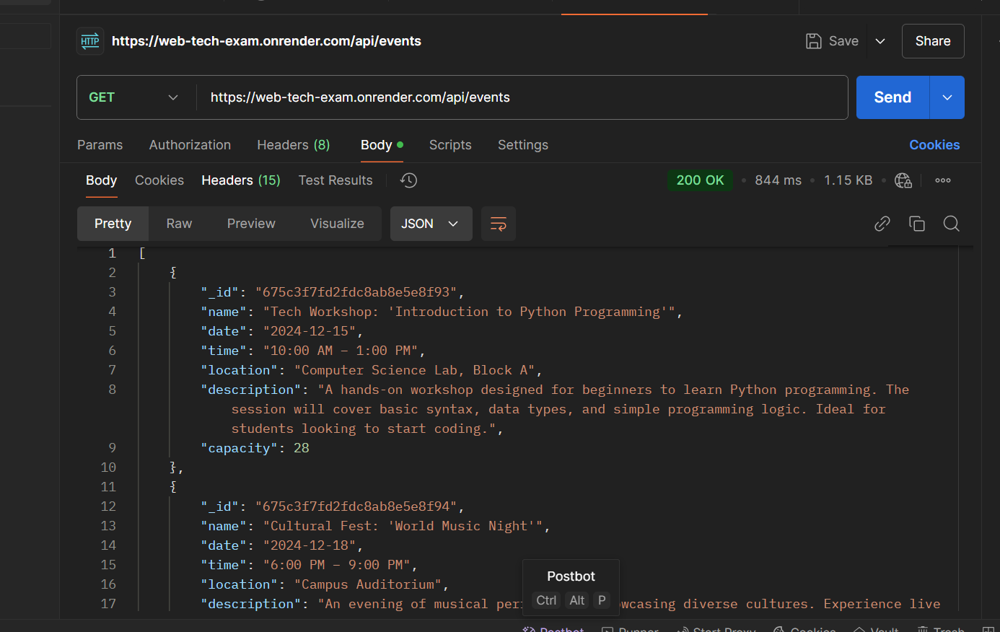
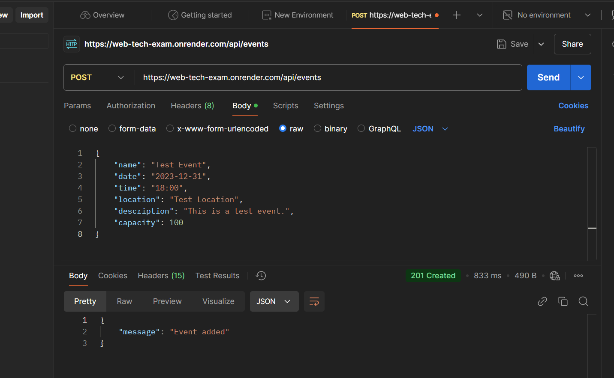

# CampusNavigator

## Table of Contents
1. [Project Overview](#project-overview)
2. [Key Features](#key-features)
3. [Technologies Used](#technologies-used)
4. [Deployment Link](#deployment-link)
5. [Login Details](#login-details)
6. [Feature Checklist](#feature-checklist)
7. [API Documentation](#api-documentation)
    - [Register User](#register-user)
    - [Login User](#login-user)
    - [Get Events](#get-events)
    - [Add Event](#add-event)
    - [RSVP to Event](#rsvp-to-event)
8. [Error Handling](#error-handling)

## Project Overview
CampusNavigator is a web application designed to help users navigate and manage events on a campus. The application provides functionalities for user registration, login, event listing, event details viewing, and RSVP for events. The application ensures that users must be logged in to access the main features, enhancing security and user management.

## Key Features
1. **User Registration and Login:**
    - Users can register with a username, email, and password.
    - Registered users can log in to access the main features of the application.
2. **Event Listing:**
    - Users can view a list of all events.
    - Each event is displayed with its name and a "View Details" button.
3. **Event Details and RSVP:**
    - Users can view detailed information about an event, including date, time, location, and description.
    - Users can RSVP to events, which updates the event's capacity and adds the event to the user's list of RSVPs.
4. **Navigation and Accessibility:**
    - The application includes a vertical navigation bar with links to Home, Events, Profile, Admin (if applicable), and Calendar pages.
    - The navigation bar is only accessible to logged-in users, ensuring that unauthorized users cannot access the main features.
5. **Responsive Design:**
    - The application is designed to be responsive, ensuring a seamless experience across different devices and screen sizes.

## Technologies Used
- **Frontend:** HTML, CSS, JavaScript
- **Backend:** Node.js, Express.js
- **Database:** MongoDB (for storing user and event data)
- **Deployment:** Render (for hosting the application)

## Deployment Link
[CampusNavigator](https://web-tech-exam.onrender.com)

## Login Details
- **Username:** test@example.com
- **Password:** nini

## Feature Checklist
### CampusNavigator Feature Checklist

#### User Authentication
- User Registration  ☒
  - Users can register with a username, email, and password  ☒
  - Registration form validation (required fields, valid email format)  ☒
  - Store user data in the database  ☒
- User Login
  - Users can log in with their email and password  ☒
  - Login form validation (required fields)  ☒
  - Store user session data in local Storage  ☒
  - Access Control  ☒
     - Redirect users to the login page if they are not logged in  ☒
     - Ensure only logged-in users can access the main features of the application  ☒

#### Event Management
- Event Listing  ☒
  - Display a list of all events  ☒
  - Each event shows the event name and a "View Details" button  ☒
- Event Details  ☒
  - Display detailed information about an event (name, date, time, location, description)  ☒
  - Allow users to RSVP to events  ☒
  - Update event capacity and user RSVPs in the database  ☒

#### Navigation
- Vertical Navigation Bar
  - Links to Home, Events, Profile, Admin (if applicable), and Calendar pages  ☒
  - Ensure the navigation bar is only accessible to logged-in users  ☒

#### Responsive Design
- Responsive Layout  ☒
  - Ensure the application is responsive and works well on different devices and screen sizes  ☒

#### Additional Features
- Admin Panel (Optional)  ☒
  - Provide an admin panel for managing events and users (if applicable)  ☒

#### Deployment
- Deploy the application on Render or another hosting service  ☒
- Ensure the application is accessible via a public URL  ☒

## API Documentation

### Register User
- **URL:** `/api/register`
- **Method:** `POST`
- **Description:** Registers a new user.
- **Request Body:**
    ```json
    {
        "username": "string",
        "email": "string",
        "password": "string",
        "preferences": ["string"],
        "isAdmin": "boolean"
    }
    ```
- **Response:**
    ```json
    {
        "message": "User registered"
    }
    ```
- **Screenshot:**
    

### Login User
- **URL:** `/api/login`
- **Method:** `POST`
- **Description:** Logs in a user.
- **Request Body:**
    ```json
    {
        "email": "string",
        "password": "string"
    }
    ```
- **Response:**
    ```json
    {
        "message": "Login successful",
        "user": {
            "username": "string",
            "email": "string",
            "preferences": ["string"],
            "isAdmin": "boolean"
        }
    }
    ```
- **Screenshot:**
    

### Get Events
- **URL:** `/api/events`
- **Method:** `GET`
- **Description:** Retrieves a list of all events.
- **Response:**
    ```json
    [
        {
            "name": "string",
            "date": "string",
            "time": "string",
            "location": "string",
            "description": "string",
            "capacity": "number"
        }
    ]
    ```
- **Screenshot:**
    

### Add Event
- **URL:** `/api/events`
- **Method:** `POST`
- **Description:** Adds a new event.
- **Request Body:**
    ```json
    {
        "name": "string",
        "date": "string",
        "time": "string",
        "location": "string",
        "description": "string",
        "capacity": "number"
    }
    ```
- **Response:**
    ```json
    {
        "message": "Event added"
    }
    ```
- **Screenshot:**
    

### RSVP to Event
- **URL:** `/api/events/:id/rsvp`
- **Method:** `POST`
- **Description:** RSVPs a user to an event.
- **Request Body:**
    ```json
    {
        "userId": "string"
    }
    ```
- **Response:**
    ```json
    {
        "message": "RSVP successful",
        "user": {
            "username": "string",
            "email": "string",
            "preferences": ["string"],
            "isAdmin": "boolean",
            "rsvps": ["string"]
        }
    }
    ```

## Error Handling
All endpoints return appropriate error messages and status codes in case of failures.
